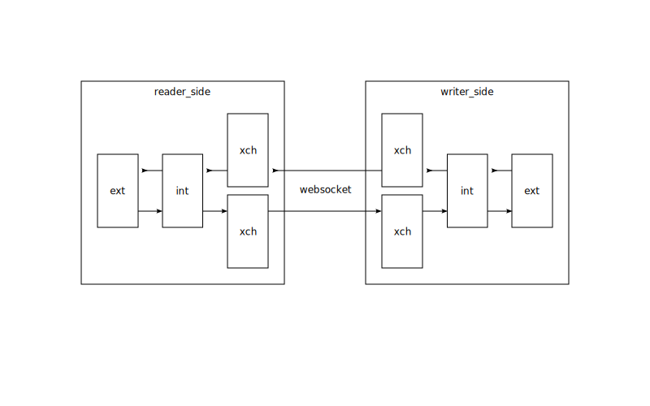

# data_connection

## Описание концепции

Цель - предоставить простой обмен данными между различными компонентами программы в системах "околопромышленной" автоматизации. Примеры компонентов:
- компоненты, опрашивающие нижестоящие системы автоматизации. В дальнейшем обозначается `reader_side`, поскольку "читает" данные полевого уровня и передает в вышестоящие компоненты. Например:
	- OPC UA клиент
	- Modbus TCP клиент
	- Modbus RTU мастер
- компоненты, предоставляющие доступ к данным вышестоящим системам. В дальнейшем обозначается `writer_side`, поскольку данные "записываются" с верхнего уровня из передаются на полевой. Например:
	- HTTP API
	- OPC UA сервер
	- Modbus TCP сервер
- компоненты, обеспечивающие логику работы программы. Может быть как `reader_side`, так и `writer_side`.

Сложность возникает в том, что данные могут быть изменены в любом компоненте. Например, значение может быть как в контроллере, так и в интерфейсе пользователя.

Информация между компонентами должна передаваться циклично (насколько это возможно в python) и в полном объеме, в не зависимости от того, были изменения в данных или нет.
- с одной стороны, это приводит к большому объему траффика, т.е. компоненты должны быть развернуты на одной системе, или на разных системах, объединённых проводной сетью.
- с другой стороны, по сравнению с протоколами, передающими информацию по изменению, упрощается логика, поскольку нет необходимости контролировать успешность передачи информации.

Как должна работать в идеале:
- описывается модель данных
- на паре компонентов, между которыми необходимо настроить связь:
	- создаются объекты соединения, в параметрах которых задаётся адрес противоположной стороны
	- создается объект данных на основе модели и передается в объект соединения
- всё, объекты данных автоматически синхронизируются между собой

## Описание реализации



Обозначение объектов данных:
- **xch** (exchange) - заполняется перед передачей (на сервере), или заполняется после передачи (на клиенте). Передача через websocket
- **int** (internal) - промежуточная область. Сохраняется между циклами.
- **ext** (extrenal) - для чтения и записи клиентским приложением.

Объекты данных создаются на основе одной модели Pydantic.

writer_side имеет более высокий приоритет, чем reader_side. Например, мы поменяли параметр на стороне writer_side. В этот же момент данные считываются на стороне reader_side. Значение из writer_side будет иметь более высокий приоритет, чем reader_side, если разница между метками времени этих значений будет меньше, чем значение в параметре `writer_priority_delay`.

Реализация построена на базе:
- [pydantic](https://pydantic-docs.helpmanual.io/) - описание модели данных
- [fastapi](https://fastapi.tiangolo.com/) - серверная часть передачи данных
- [websockets](https://websockets.readthedocs.io/en/stable/index.html) - клиентская часть передачи данных. Библиотека позволяет также создавать сервер, но поскольку в компонентах будет и так будет использоваться fastapi, поэтому только клиент.

При операциях чтения/записи сохраняются метки времени. Важно, чтобы компоненты программы были синхронизированы по времени.


## Разработка

Установить виртуальное окружение

```sh
poetry install
```

Опубликовать пакет

```sh
poetry build && poetry publish
```


## Установка

```sh

poetry install --extras "opcua"

```